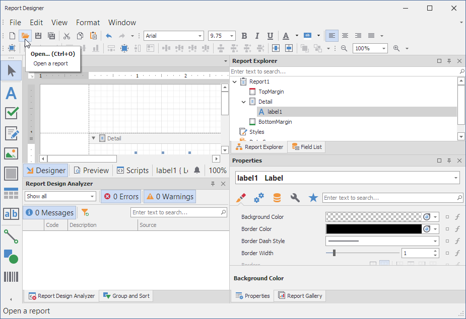

<!-- default badges list -->

<!-- default badges end -->
# Report Storage for the End-User Report Designer

This example demonstrates how to implement a report storage to store and retrieve <a href="http://documentation.devexpress.com/XtraReports/CustomDocument2592.aspx"><u>report definitions</u></a>. It contains code for the following custom storages:

- DataSetReportStorage stores reports in an XML file.
- XpoReportStorage stores reports in an [XPCollection](https://docs.devexpress.com/XPO/DevExpress.Xpo.XPCollection).
- ZipReportStorage stores reports in a zip archive.

A storage is a class that inherits the [ReportStorageExtension](https://docs.devexpress.com/XtraReports/DevExpress.XtraReports.Extensions.ReportStorageExtension) class and implements methods to store and retrieve report definitions in XML format.

Built-in report serializer does not serialize the Object data sources, data sets, XPO data sources, and user-type report parameters.  
For information on how to implement a custom XML serialization logic, review the following examples:
- [How to implement custom XML serialization of a report that is bound to a dataset](https://github.com/DevExpress-Examples/Reporting_how-to-implement-custom-xml-serialization-of-a-report-that-is-bound-to-a-dataset-e3157)
- [How to serialize the XPO data source](https://github.com/DevExpress-Examples/Reporting_how-to-serialize-an-xpo-data-source-e3169)
- [How to serialize parameters of custom types](https://github.com/DevExpress-Examples/Reporting_how-to-serialize-parameters-of-custom-types-e3186)

When you run the project, a window appears that allows you to select a report, and open the End-User Designer to edit the report, or open the report preview.

If you click **Design**, the End-User Report Designer is invoked. It allows you to open, edit and save the report.

When you click **Open** or **Save** in the Report Designer, the **Storage Editor** window appears. It allows you to select a report, and then save or load it.

The code that allows you to change the custom storage used in this example is located in the [Program.cs](./CS/Program.cs) (VB: [Program.vb](./VB/Program.vb)) file.

## Files to Look At

* [DataSetReportStorage.cs](CS/DataSetReportStorage.cs) (VB: [DataSetReportStorage.vb](VB/DataSetReportStorage.vb))
* [Form1.cs](CS/Form1.cs) (VB: [Form1.vb](VB/Form1.vb))
* [Program.cs](CS/Program.cs) (VB: [Program.vb](VB/Program.vb))
* [StorageDataSet.cs](CS/StorageDataSet.cs) (VB: [StorageDataSet.vb](VB/StorageDataSet.vb))
* [StorageEditorForm.cs](CS/StorageEditorForm.cs) (VB: [StorageEditorForm.vb](VB/StorageEditorForm.vb))
* [XpoReportStorage.cs](CS/XpoReportStorage.cs) (VB: [XpoReportStorage.vb](VB/XpoReportStorage.vb))
* [ZipReportStorage.cs](CS/ZipReportStorage.cs) (VB: [ZipReportStorage.vb](VB/ZipReportStorage.vb))

## Documentation

- [Custom Report Storage](https://docs.devexpress.com/XtraReports/10001)

## More Examples

- [WPF End-User Report Designer - How to Implement a Report Storage](https://github.com/DevExpress-Examples/Reporting_wpf-end-user-report-designer-how-to-implement-a-report-storage-t292945)
- [How to integrate the Web Report Designer into an MVC web application](https://github.com/DevExpress-Examples/Reporting_how-to-integrate-the-web-report-designer-into-an-mvc-web-application-t190370)

